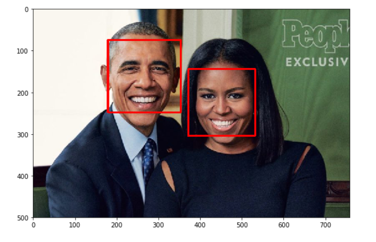
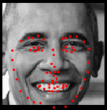

# Facial-Keypoint-Detection
## Project Overview
This project is part of Udacity Computer Vision Nanodegree. It combines the knowledge of computer vision techniques and deep learning architectures to build a facial keypoint detection system that takes in any image with faces, and predicts the location of 68 distinguishing keypoints on each face!
Facial keypoints include points around the eyes, nose, and mouth on a face and are used in many applications. These applications include: facial tracking, facial pose recognition, facial filters, and emotion recognition. Some examples of these keypoints are pictured below.

  
  
     

## Project Structure
The project will be broken up into a few main parts in four Python notebooks.     
Notebook 1 : Loading and Visualizing the Facial Keypoint Data

Notebook 2 : Defining and Training a Convolutional Neural Network (CNN) to Predict Facial Keypoints

Notebook 3 : Facial Keypoint Detection Using Haar Cascades and your Trained CNN

Notebook 4 : Fun Filters and Keypoint Uses.     
The main idea is that it detects all the faces in an image using Haar Cascade Classifiers, then passing those detected faces into a CNN to detect the facial keypoints. as illustrated in the images below. 
1) Faces detected after Haar Cascades
 
2) Facial Keypoints detected  

  
  

## Local Environment Installation Guide
1) Clone the repository 
$ git clone https://github.com/ShroukElghoul/Facial-Keypoint-Detection.git 
2) Create and install an environment depending on your OS following the steps in this [documentation](https://docs.conda.io/projects/conda/en/latest/user-guide/tasks/manage-environments.html)<br\>
3) Install pytorch and required packages.<br\>
$ conda install pytorch torchvision cudatoolkit=9.0 -c pytorch <br\>
$ pip install -r requirements.txt

