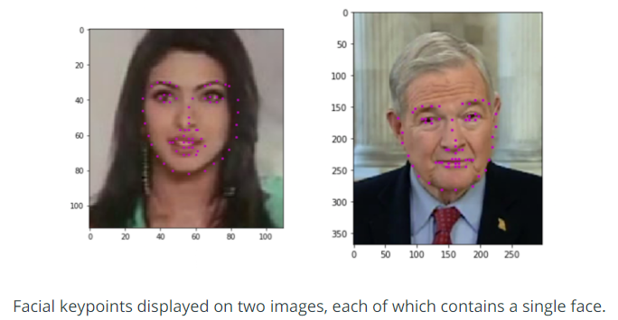

# Facial-Keypoint-Detection
## Project Overview
This project is part of Udacity Computer Vision Nanodegree. It combines the knowledge of computer vision techniques and deep learning architectures to build a facial keypoint detection system that takes in any image with faces, and predicts the location of 68 distinguishing keypoints on each face!
Facial keypoints include points around the eyes, nose, and mouth on a face and are used in many applications. These applications include: facial tracking, facial pose recognition, facial filters, and emotion recognition. Some examples of these keypoints are pictured below.

  
  
     

## Project Structure
